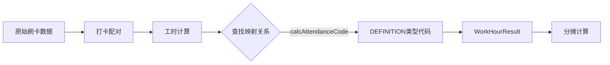

# 工时模块与计算管理出勤代码关联指南

## 📊 当前数据结构

### AttendanceCode 表结构

```prisma
model AttendanceCode {
  id               Int      @id @default(autoincrement())
  code             String   @unique  // 出勤代码
  name             String              // 出勤代码名称
  category         String             // ✅ 关键字段：分类
                          // CALCULATION - 计算管理模块的出勤代码
                          // DEFINITION   - 分摊/工时模块的出勤代码
  calcAttendanceCode String?          // ✅ 关联字段：映射的计算出勤代码
                          // 仅当 category='DEFINITION' 时使用
                          // 存储对应的 CALCULATION 类型的 code
}
```

---

## 🔄 关联机制

### 1. 数据分类

```
AttendanceCode 表
├── CALCULATION 类别（计算管理模块使用）
│   ├── code: A01（正常工时）
│   ├── code: A02（作业工时）
│   └── code: A03（分摊工时）
│
└── DEFINITION 类别（分摊/工时模块使用）
    ├── code: NORMAL_WORK（正常工时定义）
    │   └── calcAttendanceCode: A01  ← 映射到计算的A01
    ├── code: PRODUCTION_WORK（生产工时定义）
    │   └── calcAttendanceCode: A02  ← 映射到计算的A02
    └── code: ALLOCATION_WORK（分摊工时定义）
        └── calcAttendanceCode: A03  ← 映射到计算的A03
```

### 2. 数据流转过程



**详细流程**：

1. **计算管理模块**使用 `CALCULATION` 类型的出勤代码进行工时计算
   - 例如：计算出勤代码 `A01` 的工时为 8 小时

2. **推送时查找映射**
   - 通过 `calcAttendanceCode='A01'` 查找对应的 `DEFINITION` 类型出勤代码
   - 找到：`code='NORMAL_WORK', calcAttendanceCode='A01'`

3. **存储到工时模块**
   - 在 `WorkHourResult` 表中存储：
     - `attendanceCodeId`: DEFINITION类型的ID
     - `attendanceCode`: DEFINITION类型的code（如 'NORMAL_WORK'）
     - `calcAttendanceCode`: CALCULATION类型的code（如 'A01'）

---

## 🎯 配置步骤

### 步骤1：创建 DEFINITION 类型的出勤代码

需要先创建工时模块使用的出勤代码：

```json
POST /api/calculate/attendance-codes

{
  "code": "NORMAL_WORK",
  "name": "正常工时",
  "category": "DEFINITION",          // ✅ 重要：设置为 DEFINITION
  "calcAttendanceCode": "A01",      // ✅ 映射到计算模块的 A01
  "type": "LEAN_HOURS",
  "calculateHours": true,
  "showInDetailPage": true,
  "priority": 1,
  "color": "#52c41a"
}
```

### 步骤2：查看当前映射关系

```bash
GET /api/calculate/attendance-codes?category=DEFINITION
```

响应示例：

```json
{
  "items": [
    {
      "id": 10,
      "code": "NORMAL_WORK",
      "name": "正常工时",
      "category": "DEFINITION",
      "calcAttendanceCode": "A01",  // ✅ 映射的计算代码
      "calcAttendanceCodeObj": {    // 关联的计算代码对象
        "id": 1,
        "code": "A01",
        "name": "正常工时",
        "category": "CALCULATION"
      }
    }
  ]
}
```

---

## 📋 示例配置数据

### 完整的映射配置示例

```json
[
  {
    "code": "NORMAL_WORK",
    "name": "正常工时",
    "category": "DEFINITION",
    "calcAttendanceCode": "A01",
    "type": "LEAN_HOURS",
    "calculateHours": true,
    "showInDetailPage": true,
    "color": "#52c41a"
  },
  {
    "code": "PRODUCTION_WORK",
    "name": "生产工时",
    "category": "DEFINITION",
    "calcAttendanceCode": "A02",
    "type": "LEAN_HOURS",
    "calculateHours": true,
    "showInDetailPage": true,
    "color": "#1890ff"
  },
  {
    "code": "ALLOCATION_WORK",
    "name": "分摊工时",
    "category": "DEFINITION",
    "calcAttendanceCode": "A03",
    "type": "LEAN_HOURS",
    "calculateHours": true,
    "showInDetailPage": true,
    "color": "#faad14"
  },
  {
    "code": "OVERTIME_WORK",
    "name": "加班工时",
    "category": "DEFINITION",
    "calcAttendanceCode": "A04",
    "type": "LEAN_HOURS",
    "calculateHours": true,
    "showInDetailPage": true,
    "color": "#f5222d"
  },
  {
    "code": "LEAVE_WORK",
    "name": "请假工时",
    "category": "DEFINITION",
    "calcAttendanceCode": "A05",
    "type": "LEAN_HOURS",
    "calculateHours": false,
    "showInDetailPage": true,
    "color": "#722ed1"
  }
]
```

---

## 🔧 需要实现的功能

### 1. 前端配置页面

修改 `/allocation/attendance-code-definition` 页面：

```typescript
// 添加分类选择
<Select
  value={category}
  onChange={(value) => setCategory(value)}
  options={[
    { label: '出勤代码定义（工时模块）', value: 'DEFINITION' },
    { label: '工时计算代码（计算模块）', value: 'CALCULATION' },
  ]}
/>

// 当选择 DEFINITION 时，显示映射配置
{category === 'DEFINITION' && (
  <Form.Item label="映射的计算出勤代码">
    <Select
      value={calcAttendanceCode}
      onChange={(value) => setCalcAttendanceCode(value)}
      options={calculationCodes.map(code => ({
        label: `${code.code} - ${code.name}`,
        value: code.code,
      }))}
    />
  </Form.Item>
)}
```

### 2. 后端API增强

```typescript
// 获取可映射的计算出勤代码列表
@Get('calculation-codes')
async getCalculationCodes() {
  return this.prisma.attendanceCode.findMany({
    where: {
      category: 'CALCULATION',
      status: 'ACTIVE',
    },
    select: {
      id: true,
      code: true,
      name: true,
    },
  });
}

// 获取映射关系视图
@Get('mapping-view')
async getMappingView() {
  const definitionCodes = await this.prisma.attendanceCode.findMany({
    where: { category: 'DEFINITION' },
    include: {
      // 关联的计算代码
      calcAttendanceCodeObj: {
        where: { category: 'CALCULATION' },
        select: { id: true, code: true, name: true },
      },
    },
  });

  return definitionCodes.map(code => ({
    ...code,
    mappedCalcCode: code.calcAttendanceCode,
    mappedCalcCodeName: code.calcAttendanceCodeObj?.name,
  }));
}
```

---

## ⚠️ 注意事项

### 1. category 字段的重要性

- ✅ **CALCULATION**：计算管理模块使用，用于工时计算
- ✅ **DEFINITION**：分摊/工时模块使用，用于定义分摊规则

### 2. calcAttendanceCode 字段的限制

- 只有 `category='DEFINITION'` 时才使用此字段
- 必须对应一个存在的 `category='CALCULATION'` 的出勤代码
- 允许为空（不映射任何计算出勤代码）

### 3. 数据一致性

```typescript
// 推送数据时验证映射关系
const mappedCode = codeMapping.get(calcResult.attendanceCode);

if (!mappedCode) {
  // 如果计算代码没有对应的定义代码，可以选择：
  // 1. 跳过此数据
  // 2. 创建默认的DEFINITION代码
  // 3. 抛出错误
}
```

---

## 📊 数据库查询示例

### 查询所有映射关系

```sql
SELECT
  def.code AS definition_code,
  def.name AS definition_name,
  def.calc_attendance_code AS calc_code,
  calc.name AS calc_name
FROM AttendanceCode def
LEFT JOIN AttendanceCode calc
  ON def.calc_attendance_code = calc.code
WHERE def.category = 'DEFINITION';
```

### 查找未映射的DEFINITION代码

```sql
SELECT code, name
FROM AttendanceCode
WHERE category = 'DEFINITION'
  AND (calc_attendance_code IS NULL OR calc_attendance_code = '');
```

---

## 🎯 最佳实践

### 1. 命名规范

```
CALCULATION 类别：简短代码
- A01, A02, A03... 或
- WORK_NORMAL, WORK_PRODUCTION, WORK_ALLOCATION...

DEFINITION 类别：描述性名称
- NORMAL_WORK, PRODUCTION_WORK, ALLOCATION_WORK...
```

### 2. 配置流程

1. 先创建 `CALCULATION` 类型的出勤代码（计算模块）
2. 再创建 `DEFINITION` 类型的出勤代码（工时模块）
3. 在 DEFINITION 代码中配置 `calcAttendanceCode` 映射
4. 验证映射关系是否正确

### 3. 测试验证

```typescript
// 测试映射查询
const testMapping = async (calcCode: string) => {
  const definition = await prisma.attendanceCode.findFirst({
    where: {
      category: 'DEFINITION',
      calcAttendanceCode: calcCode,
    },
  });

  console.log(`计算代码 ${calcCode} 映射到:`, definition?.code);
};

await testMapping('A01'); // 应输出: NORMAL_WORK
```
